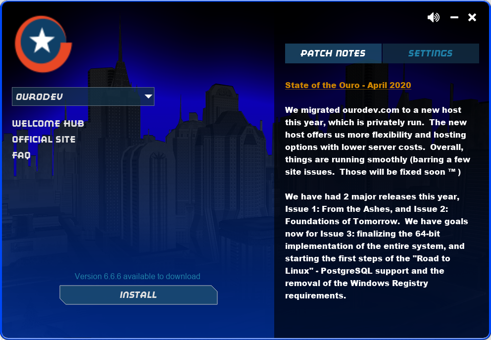

# Launcher
**Launcher** is a very early prototype of an alternative launcher for [Ourodev's](https://ourodev.com/) 
version of [City of Heroes](https://en.wikipedia.org/wiki/City_of_Heroes).

Launcher aims to provide a single binary solution that, upon execution, presents a hopefully aesthetically pleasing user interface from which tasks such as reading patch notes and launching [City of Heroes](https://en.wikipedia.org/wiki/City_of_Heroes) can be accomplished.

**Planned features are:**
* Single binary, *xcopy* (or *cp*) installable
* Platform independence
* Delta updates
* Multi [City of Heroes](https://en.wikipedia.org/wiki/City_of_Heroes) distribution support
* User interface fitting the [City of Heroes](https://en.wikipedia.org/wiki/City_of_Heroes) theme

## Implementation
Launcher is a [GoDot](https://godotengine.org/) project using [GDScript](https://docs.godotengine.org/en/stable/getting_started/scripting/gdscript/gdscript_basics.html) to accomplish its various tasks. In the future it might be necessary to fall back and use [C#/Mono](https://godotengine.org/article/introducing-csharp-godot) to accomplish complex operations.